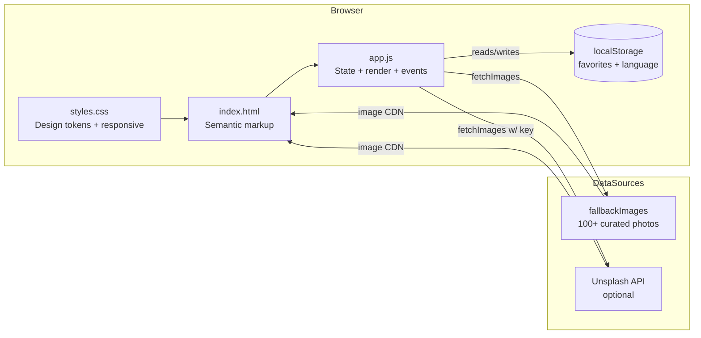

# Lumina Gallery — Step-by-Step Build Guide

> **Archived: original build playbook.** This document is the original roadmap used to build Lumina Gallery from an empty folder to a deployable photo gallery. It is intentionally kept as a "making-of" narrative; the codebase may have evolved since this guide was written. For the current setup, architecture, and deployment notes, see [../README.md](../README.md).

---

> **Project Summary:** Lumina Gallery is a responsive, accessible, dependency-free photo gallery web app. It renders a masonry grid of photographs, supports a full-screen lightbox with keyboard, touch, slideshow, fullscreen, and download controls, and persists user favorites in `localStorage`. Content is sourced from the optional Unsplash API with a built-in fallback dataset of 100+ curated images, so the app works fully offline-of-API. The UI ships a bilingual (English/Turkish) layer driven entirely by `data_*` attributes, a debounced client-side search, infinite scroll via `IntersectionObserver`, and skeleton loading states. There is no backend, build step, or framework: the entire app is plain HTML5, modern CSS3, and ES6+ JavaScript served as static files.

Each step below is a self-contained prompt. Execute them in order.

Stack: HTML5, CSS3 (Grid, Flexbox, Custom Properties, Backdrop Filter), Vanilla JavaScript (ES6+), Unsplash API (optional), Web Storage API (`localStorage`), Fullscreen API, IntersectionObserver API, Netlify (static hosting).

---

## Table of Contents

**PHASE 1 — Project Foundation**

- STEP 1 — Project Scaffolding & File Structure
- STEP 2 — HTML Document Skeleton & Fonts
- STEP 3 — Semantic Layout Markup (Header, Hero, Gallery, Lightbox, Footer)

**PHASE 2 — Design System & Layout**

- STEP 4 — CSS Reset, Design Tokens & Dark Theme
- STEP 5 — Header, Navigation & Responsive Masonry Grid
- STEP 6 — Lightbox, Skeletons & Responsive Breakpoints

**PHASE 3 — Core Gallery Engine**

- STEP 7 — App Configuration, State & DOM Element Cache
- STEP 8 — Image Data Layer (Fallback Dataset + Unsplash Fetch)
- STEP 9 — Gallery Rendering & Masonry Row-Span Logic

**PHASE 4 — Interactive Features**

- STEP 10 — Lightbox Viewer & Navigation
- STEP 11 — Favorites with localStorage
- STEP 12 — Search, Category Filtering & Infinite Scroll
- STEP 13 — Slideshow, Fullscreen & Download
- STEP 14 — Bilingual UI (i18n)

**PHASE 5 — Accessibility, Hardening & Deploy**

- STEP 15 — Accessibility, Keyboard & Touch Support
- STEP 16 — Security Hardening & Memory-Safety
- STEP 17 — Final Polish, Documentation & Deployment

**Appendices**

- Appendix A — Shared Constants (CONFIG & CSS Tokens)
- Appendix B — Reusable Patterns
- Appendix C — Pre-flight Checklist
- Appendix D — Common Pitfalls

---

## Global Build Rules (apply to EVERY step)

- **No git operations.** Do not run `git init`, `add`, `commit`, `push`, or any other `git` command. Version control is handled manually by the user.
- Do not install unapproved packages. This project has zero runtime dependencies by design; do not introduce npm, bundlers, or frameworks.
- Do not run long-running processes (dev servers, watchers) unless the user explicitly requests it. A simple static file server is sufficient for manual testing.
- Treat every step as self-contained: it states its goal, the files it touches, implementation notes, and an acceptance check.
- Prefer modern, native APIs (ES6+, `fetch`, `IntersectionObserver`, `localStorage`, Fullscreen API) over libraries.
- Keep code clean, readable, and commented only where intent is non-obvious. Use English, descriptive, camelCase identifiers.
- Prioritize security (escape all interpolated data), accessibility (ARIA, focus management, reduced motion), and performance (lazy loading, `srcset`, debouncing).

---

## Architecture at a Glance

Lumina Gallery is a single static page. All logic lives in one module-free script that owns a central `state` object and renders into a single grid container. Images come from a fallback dataset by default, or the Unsplash API when an access key is configured.



Key relationships:

- `index.html` provides the static shell and all `data_*` translation attributes; it loads `css/styles.css` and `js/app.js`.
- `js/app.js` is the controller: it owns `state`, caches DOM nodes in `elements`, fetches data via `fetchImages()`, and renders cards into `#galleryGrid`.
- `localStorage` persists two keys: favorites and the selected language.
- The Unsplash API is optional; when no key is present the app transparently uses the fallback dataset, so it never hard-fails.

---

# PHASE 1 — PROJECT FOUNDATION

---

## STEP 1 — Project Scaffolding & File Structure

**Goal:** Establish a minimal, framework-free static project layout.

**Files/folders to create:**

```
photo-gallery/
├── index.html
├── css/
│   └── styles.css
├── js/
│   └── app.js
├── .gitignore
└── README.md
```

**Implementation notes:**

- No `package.json`, bundler, or transpiler. The app must run by opening `index.html` (or via any static server).
- Keep separation of concerns: structure in `index.html`, presentation in `css/styles.css`, behavior in `js/app.js`.
- `.gitignore` should exclude OS/editor cruft (`.DS_Store`, `Thumbs.db`, `.vscode/` if desired) and any local secrets.

**Acceptance check:** Opening `index.html` in a browser shows a blank page with no console errors and both `styles.css` and `app.js` load (verify in the Network tab).

---

## STEP 2 — HTML Document Skeleton & Fonts

**Goal:** Create a valid, accessible HTML5 document head with typography preloaded.

**Files to edit:** `index.html`

**Implementation notes:**

- Use `<!DOCTYPE html>` and `<html lang="en">` (the `lang` attribute is updated at runtime by the i18n layer).
- Add responsive and SEO meta: `charset=UTF-8`, `viewport=width=device-width, initial-scale=1.0`, and a `description`.
- Preconnect to `fonts.googleapis.com` and `fonts.gstatic.com`, then load **Playfair Display** (display serif) and **Source Sans 3** (body sans).
- Link `css/styles.css` in `<head>` and load `js/app.js` with a plain `<script>` at the end of `<body>` (script runs after DOM is parsed).

**Acceptance check:** Fonts load (verify in Network), no layout shift warnings, and the document validates as HTML5.

---

## STEP 3 — Semantic Layout Markup

**Goal:** Lay out all page regions with semantic, accessible markup and `data_*` translation hooks.

**Files to edit:** `index.html`

**Regions to build:**

- `<header class="header">`: logo, mobile menu toggle (hamburger), search box (input + search/clear buttons), and `<nav>` with category buttons (`All`, `Nature`, `Architecture`, `People`, `Favorites`).
- `<section class="hero">`: title and subtitle.
- `<main class="gallery-container">`: search-results info bar, no-results state, empty-favorites state, `#galleryGrid`, a loader, an infinite-scroll sentinel, and an end-of-content message.
- `<div class="lightbox">`: overlay, top controls (slideshow toggle + speed select, favorite/download/fullscreen/close), prev/next nav, image container with loader, info block (title/author/counter), and a slideshow progress bar.
- `<footer class="footer">`: attribution.

**Implementation notes:**

- Every user-facing string that must be translated carries both `data_tr` and `data_en` attributes (e.g. `data_tr="Tumu" data_en="All"`). Inputs use the same attributes for their placeholder.
- Use inline SVG icons (no icon font dependency).
- Add ARIA: `aria-label` on icon-only buttons, `role="dialog"` + `aria-modal="true"` on the lightbox, `aria-expanded` on the menu toggle.
- Give interactive cards/buttons stable `id`s used by `app.js` (`galleryGrid`, `lightbox`, `searchInput`, `slideshowToggle`, etc.).

**Acceptance check:** Page outline is fully navigable by landmarks; all controls exist in the DOM even if not yet wired up.

---

# PHASE 2 — DESIGN SYSTEM & LAYOUT

---

## STEP 4 — CSS Reset, Design Tokens & Dark Theme

**Goal:** Define a cohesive dark "moody" theme via CSS custom properties.

**Files to edit:** `css/styles.css`

**Implementation notes:**

- Add a universal reset (`margin/padding: 0`, `box-sizing: border-box`).
- Declare design tokens on `:root` — see Appendix A. Cover: background layers, gold accent palette, favorite (red) color, text colors, borders, shadows, font stacks, spacing scale, transitions, radii, and grid gap.
- Apply base styles: body background (with subtle radial gradients), default typography, link colors, and a `.hidden { display: none !important; }` utility.

**Acceptance check:** Body renders with the dark theme and accent gradients; no hard-coded colors outside `:root` going forward.

---

## STEP 5 — Header, Navigation & Responsive Masonry Grid

**Goal:** Style the header, search, navigation, and the masonry gallery grid.

**Files to edit:** `css/styles.css`

**Implementation notes:**

- Header is `position: fixed` with `backdrop-filter: blur()`; content max-width is centered.
- Navigation buttons get pill styling with an animated `::before` hover fill and an `.active` state. The Favorites button and the language toggle get their own variants.
- The grid uses `display: grid` with `grid-auto-rows: 10px` to enable a masonry effect driven by per-card `grid-row: span N` (computed in JS). Column counts scale by breakpoint (2 → 3 → 4 columns).
- Add card hover/focus affordances: gradient overlay, scale-up image, revealed info block, and a favorite button.

**Acceptance check:** Resizing the window reflows columns smoothly; cards form a staggered masonry layout.

---

## STEP 6 — Lightbox, Skeletons & Responsive Breakpoints

**Goal:** Style the modal lightbox, skeleton loaders, and all responsive/accessibility media queries.

**Files to edit:** `css/styles.css`

**Implementation notes:**

- Lightbox: full-viewport overlay with blur, centered image (`object-fit: contain`), circular control buttons, edge nav arrows, and a bottom info panel. Add a `.fullscreen` variant and a slideshow progress bar.
- Skeletons: shimmer animation via an animated `background-position` gradient.
- Breakpoints: `1024px`, `768px` (mobile drawer nav + hamburger), `480px`, `360px`, plus a landscape `max-height: 500px` case and a touch-device block (`hover: none`).
- Accessibility: honor `prefers-reduced-motion` (near-zero animations) and add print styles.

**Acceptance check:** The lightbox is usable from 320px to large desktops; reduced-motion users see no large animations.

---

# PHASE 3 — CORE GALLERY ENGINE

---

## STEP 7 — App Configuration, State & DOM Element Cache

**Goal:** Establish the single source of truth for configuration, runtime state, and DOM references.

**Files to edit:** `js/app.js`

**Implementation notes:**

- `CONFIG`: Unsplash access key placeholder, `imagesPerPage`, `useFallbackImages`, category→query mapping, slideshow defaults, skeleton count, supported `languages`, and `storageKeys` (favorites + language). See Appendix A.
- `state`: arrays for `images` / `filteredImages` / `favorites`, plus `currentCategory`, `currentPage`, `currentImageIndex`, `searchQuery`, and flags (`isLoading`, `isLightboxOpen`, `isSlideShowPlaying`, `hasMoreImages`, `isFullscreen`), `currentLanguage`, and `focusTrapHandler`.
- `elements`: cache every `getElementById`/`querySelector` lookup once at load.

**Acceptance check:** `state` and `elements` are defined with no `null` element references for IDs present in the DOM.

---

## STEP 8 — Image Data Layer

**Goal:** Provide images from a local fallback dataset, with an optional Unsplash path.

**Files to edit:** `js/app.js`

**Implementation notes:**

- Define `fallbackImages`: 100+ objects, each `{ id, title, author, category, urls: { small, regular, full }, alt, aspectRatio }`, grouped by category. Use Unsplash CDN URLs with width/quality query params (`?w=400&q=80`, etc.).
- `fetchImages(category, page)`: when `useFallbackImages` is true or the key is the placeholder, return `getFallbackImages(...)`; otherwise call the Unsplash REST endpoint with `Client-ID` auth and normalize the response to the same image shape. On any error, fall back gracefully.
- `getFallbackImages(category, page)`: filter by category and paginate by `imagesPerPage`.

**Acceptance check:** With no API key, `fetchImages('nature', 1)` resolves to a page of nature images; an invalid key still yields fallback images without throwing.

---

## STEP 9 — Gallery Rendering & Masonry Row-Span Logic

**Goal:** Convert image objects into accessible, masonry-aware DOM cards.

**Files to edit:** `js/app.js`

**Implementation notes:**

- `createGalleryItemHTML(image, index)`: compute `rowSpan = Math.ceil((1 / image.aspectRatio) * 25) + 2` so taller images span more rows. Build an `<article>` card with a favorite button, a responsive `` (`srcset` + `sizes`, `loading="lazy"`, `decoding="async"`), and an info block.
- **Escape every interpolated value** (`id`, `title`, `author`, `alt`, URLs) — see Step 16 and Appendix B.
- `renderGallery(images, append)`: map to HTML and either replace or append into `#galleryGrid`, then attach listeners.
- Add `showSkeletonLoading()` / `removeSkeletons()` for loading states.

**Acceptance check:** Cards render in a staggered masonry layout; images lazy-load while scrolling; no attribute breakage with quotes in data.

---

# PHASE 4 — INTERACTIVE FEATURES

---

## STEP 10 — Lightbox Viewer & Navigation

**Goal:** Open any image full-screen with prev/next navigation and preloading.

**Files to edit:** `js/app.js`

**Implementation notes:**

- `openLightbox(index)` / `closeLightbox()`: toggle `.active`, lock body scroll, manage focus (see Step 15/16).
- `updateLightboxImage()`: show the loader, set title/author/counter, then preload the `regular` URL via `new Image()` and swap on `onload` (fall back to `small` on error).
- `nextImage()` / `prevImage()` with boundary handling; in slideshow mode, `next` loops back to the first image.
- `updateNavigationButtons()` disables prev/next at the ends.

**Acceptance check:** Clicking a card opens the lightbox with the correct image; arrows and counter behave correctly at boundaries.

---

## STEP 11 — Favorites with localStorage

**Goal:** Let users favorite images, persisted across sessions.

**Files to edit:** `js/app.js`

**Implementation notes:**

- `loadFavorites()` / `saveFavorites()` wrap `localStorage` access in try/catch.
- `toggleFavorite(id)` updates `state.favorites`, persists, and calls `updateFavoritesUI()`.
- `updateFavoritesUI()` syncs the nav Favorites button, each card's heart button, and the lightbox favorite button (outline vs filled SVG).
- A dedicated "Favorites" category view filters across both loaded and fallback images; removing the last favorite shows the empty state.

**Acceptance check:** Favoriting survives a page reload; the Favorites view lists exactly the saved images.

---

## STEP 12 — Search, Category Filtering & Infinite Scroll

**Goal:** Filter content by category, free-text search, and auto-load more on scroll.

**Files to edit:** `js/app.js`

**Implementation notes:**

- `filterByCategory(category, forceReload)` resets pagination/state, updates the active button, clears any active search, and loads either the favorites view or a fresh page.
- `performSearch(query)` (debounced 300ms) filters `state.images` by title/author/alt; show results info or a no-results state, and hide infinite-scroll UI during search.
- `setupInfiniteScroll()` uses an `IntersectionObserver` on `#scrollSentinel` (with `rootMargin`) to call `loadMoreImages()` while not loading, not at the end, and not in the favorites view.
- `loadImages(append)` orchestrates skeletons/loader, fetch, dedupe, render, and end-of-content detection.

**Acceptance check:** Categories swap content instantly; typing filters live; scrolling to the bottom appends the next page until exhausted.

---

## STEP 13 — Slideshow, Fullscreen & Download

**Goal:** Add lightbox power features.

**Files to edit:** `js/app.js`

**Implementation notes:**

- Slideshow: `startSlideshow()` / `stopSlideshow()` / `toggleSlideshow()` drive a `setInterval` advance with a CSS-animated progress bar (`resetSlideshowProgress()` forces a reflow before re-animating). Speed is read from the `<select>`.
- Fullscreen: `enterFullscreen()` / `exitFullscreen()` / `toggleFullscreen()` use the Fullscreen API with `webkit`/`ms` fallbacks; `handleFullscreenChange()` keeps state in sync when the user exits via Esc.
- Download: `downloadImage()` fetches the `full` URL as a blob and triggers an `<a download>`; on failure it opens the image in a new tab.

**Acceptance check:** Slideshow auto-advances and loops; fullscreen toggles cleanly; download saves a file (or opens a tab on CORS failure).

---

## STEP 14 — Bilingual UI (i18n)

**Goal:** Provide a one-click English/Turkish switch driven by `data_*` attributes.

**Files to edit:** `js/app.js`, `index.html`, `css/styles.css`

**Implementation notes:**

- Add a language toggle button (`#langToggle`) in the nav, styled separately from category buttons so it is excluded from the `.nav-btn` category handler.
- `resolveInitialLanguage()` reads the stored preference, else derives from `navigator.language`.
- `applyTranslations(lang)` iterates `[data_en], [data_tr]` and updates: `placeholder` for inputs; the trailing text node for icon+text buttons (so SVGs are preserved); `aria-label` for icon-only controls; otherwise `textContent`.
- `setLanguage(lang)` updates `document.documentElement.lang`, applies translations, updates the toggle label (showing the language to switch to), and persists the choice. `toggleLanguage()` flips between the two.
- Call `setLanguage(resolveInitialLanguage())` first in `init()`.

**Acceptance check:** Toggling swaps all labels and placeholders without destroying icons; the choice persists on reload and `<html lang>` updates.

---

# PHASE 5 — ACCESSIBILITY, HARDENING & DEPLOY

---

## STEP 15 — Accessibility, Keyboard & Touch Support

**Goal:** Make the gallery fully operable by keyboard, screen readers, and touch.

**Files to edit:** `js/app.js`

**Implementation notes:**

- Gallery cards are focusable (`tabindex="0"`, `role="button"`) and open on Enter/Space.
- Global keyboard handler (only when the lightbox is open): `Escape` (exit fullscreen, else close), `ArrowLeft/Right`, `Home/End`, `Space` (slideshow), `F` (fullscreen), `D` (download).
- `trapFocus(element)` constrains Tab focus within the lightbox; it queries focusable elements lazily and filters to visible ones.
- Touch: `setupTouchSupport()` adds passive `touchstart`/`touchend` swipe detection with a threshold to go prev/next.

**Acceptance check:** The entire flow (browse → open → navigate → close) is possible with keyboard only; swipes work on a touch device/emulator.

---

## STEP 16 — Security Hardening & Memory-Safety

**Goal:** Prevent XSS/attribute breakout and listener leaks.

**Files to edit:** `js/app.js`

**Implementation notes:**

- `escapeHTML(text)` must escape `&`, `<`, `>`, `"`, and `'` so values are safe both as text and inside quoted attributes. Apply it to every value interpolated into markup in `createGalleryItemHTML()` (id, title, author, alt, urls). This matters most for live Unsplash data.
- Focus-trap cleanup: store the handler on `state.focusTrapHandler` and remove it via `releaseFocusTrap()` inside `closeLightbox()`, so opening the lightbox repeatedly does not accumulate `keydown` listeners.
- Restore focus on close by matching the current image's `data-id` (robust against index drift from slideshow/Home/End), not a positional `data-index`.

**Acceptance check:** A title containing `">` renders inert as text; opening/closing the lightbox many times adds no duplicate listeners (verify in the Memory/Event Listeners panel).

---

## STEP 17 — Final Polish, Documentation & Deployment

**Goal:** Ship it.

**Files to edit:** `README.md`, repository docs.

**Implementation notes:**

- Run the app through the Pre-flight Checklist (Appendix C) and fix any Common Pitfalls (Appendix D).
- Keep `README.md` in sync with implemented features (search, favorites, slideshow, fullscreen, download, infinite scroll, i18n) and the accurate keyboard map.
- Optional: configure the Unsplash key and set `useFallbackImages: false` for live data.
- Deploy as static files to Netlify (drag-and-drop or Git integration). No build command is required; the publish directory is the project root.

**Acceptance check:** The deployed URL loads the gallery, lightbox, and all features over HTTPS with no console errors.

---

# Appendix A — Shared Constants (CONFIG & CSS Tokens)

**JavaScript `CONFIG` (in `js/app.js`):**

```javascript
const CONFIG = {
    unsplashAccessKey: 'YOUR_UNSPLASH_ACCESS_KEY',
    imagesPerPage: 12,
    useFallbackImages: true,
    categories: {
        all: '',
        nature: 'nature,landscape,forest,mountains',
        architecture: 'architecture,building,city',
        people: 'people,portrait,street'
    },
    slideshowInterval: 3000,
    skeletonCount: 8,
    languages: ['en', 'tr'],
    storageKeys: {
        favorites: 'lumina_gallery_favorites',
        language: 'lumina_gallery_language'
    }
};
```

**Core CSS tokens (in `css/styles.css` `:root`):** dark background layers (`--color-bg-primary` … `--color-bg-card`), gold accents (`--color-accent-primary: #c9a962`), favorite red (`--color-favorite: #e74c3c`), text scale, border/shadow tokens, font stacks (`--font-display`, `--font-body`), a spacing scale (`--spacing-xs` … `--spacing-2xl`), transitions, radii, and `--grid-gap`.

---

# Appendix B — Reusable Patterns

**Safe HTML escaping (text + attributes):**

```javascript
function escapeHTML(text) {
    return String(text ?? '')
        .replace(/&/g, '&amp;')
        .replace(/</g, '&lt;')
        .replace(/>/g, '&gt;')
        .replace(/"/g, '&quot;')
        .replace(/'/g, '&#39;');
}
```

**Debounce (used for search and resize):**

```javascript
function debounce(func, wait) {
    let timeout;
    return function executed(...args) {
        clearTimeout(timeout);
        timeout = setTimeout(() => func(...args), wait);
    };
}
```

**Masonry row-span from aspect ratio:**

```javascript
const rowSpan = Math.ceil((1 / image.aspectRatio) * 25) + 2;
// applied as: style="grid-row: span ${rowSpan};" with grid-auto-rows: 10px
```

**Central state + cached elements:** a single `state` object mutated by feature functions, and an `elements` map populated once at load, keep the app framework-free yet predictable.

---

# Appendix C — Pre-flight Checklist

- [ ] Page loads with no console errors and both CSS/JS are fetched.
- [ ] Masonry grid reflows correctly across 360px → desktop widths.
- [ ] Category switching, debounced search, and no-results state all work.
- [ ] Favorites persist across reloads; Favorites view + empty state correct.
- [ ] Infinite scroll appends pages and stops at end-of-content.
- [ ] Lightbox: open/close, prev/next, counter, image preload + fallback.
- [ ] Slideshow advances/loops with progress bar; speed select works.
- [ ] Fullscreen enter/exit (including Esc) stays in sync.
- [ ] Download saves a file or opens a tab on CORS failure.
- [ ] Language toggle swaps all labels/placeholders, preserves icons, persists.
- [ ] Keyboard-only and touch-only flows fully usable; focus trap cleans up.
- [ ] `prefers-reduced-motion` disables large animations.
- [ ] All interpolated data is escaped (XSS-safe).

---

# Appendix D — Common Pitfalls

- **Wiping icons during translation.** Setting `textContent` on icon+text buttons deletes inline SVGs. Update only the trailing text node, or set `aria-label` for icon-only controls.
- **Including the language toggle in the category handler.** If it carries the `.nav-btn` class, the category click loop will call `filterByCategory(undefined)`. Give it a distinct class.
- **Attribute breakout / XSS.** A naive `escapeHTML` that relies on `div.innerHTML` does not escape quotes, so a `"` in API data breaks attributes. Escape `"` and `'` explicitly.
- **Focus-trap listener leak.** Adding a `keydown` trap on every `openLightbox()` without removing it accumulates listeners. Track and remove via `releaseFocusTrap()` on close.
- **Index drift on close.** Restoring focus by positional `data-index` misfires after slideshow/Home/End. Match the current image's `data-id` instead.
- **Masonry gaps.** Forgetting `grid-auto-rows: 10px` (or mismatching the row-span multiplier) breaks the staggered layout.
- **Assuming the API always works.** Always degrade to `fallbackImages` on missing key, non-200 responses, or network errors.

---
```

